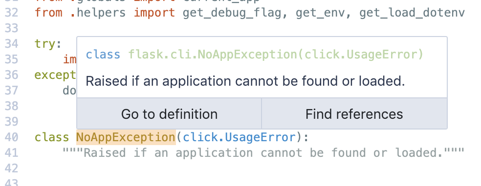

# Python



This extension adds Python code intelligence to Sourcegraph using a [Python language server](https://github.com/Microsoft/python-language-server) (the [@sourcegraph fork](https://github.com/sourcegraph/python-language-server/tree/wip2)).

[**🗃️ Source code**](https://github.com/sourcegraph/sourcegraph-python)

[**➕ View in extension registry**](https://sourcegraph.com/extensions/sourcegraph/python)

## Features

For Python code viewed on [Sourcegraph](https://sourcegraph.com) and when using the [Sourcegraph browser extension](https://docs.sourcegraph.com/integration/browser_extension):

-   Hovers with documentation and inferred type signatures
-   Go to definition
-   Find references

## Usage on your own Sourcegraph instance

Run the language server Docker container:

```
docker run --rm -p 4288:4288 sourcegraph/lang-python:insiders
```

Add these to your Sourcegraph settings:

```
  "python.languageServer.url": "ws://localhost:4288",
  "python.sourcegraph.url": "http://host.docker.internal:7080",
```

If you're running on Linux, change `python.sourcegraph.url` to the IP given by:

```bash
ip addr show docker0 | grep -Po 'inet \K[\d.]+'
```

## Usage on Sourcegraph.com

This extension is enabled for all users by default on Sourcegraph.com and when using the [Sourcegraph browser extension](https://docs.sourcegraph.com/integration/browser_extension) on public code.

To use it, just visit a Python file and hover over tokens. Examples:

-   Tensorflow: [tensorflow_ranking/examples/tf_ranking_libsvm.py](https://sourcegraph.com/github.com/tensorflow/ranking@931e4e18d68612d0b29dc3c81994acdd4b6ab743/-/blob/tensorflow_ranking/examples/tf_ranking_libsvm.py#L294:27&tab=references)
-   Flask: [flask/views.py](https://sourcegraph.com/github.com/pallets/flask/-/blob/flask/views.py)
-   Zulip: [corporate/lib/stripe.py](https://sourcegraph.com/github.com/zulip/zulip/-/blob/corporate/lib/stripe.py)
-   Trivial sample: [pkg0/m0.py](http://sourcegraph.com/github.com/sgtest/python-sample-0/-/blob/pkg0/m0.py)


### On self-hosted Sourcegraph instances

_Documentation to be added soon._

## Known issues

-   Dependencies are not installed. Hovers, definitions, and references only work for sources checked into the single repository you are viewing.
-   Cross-repository definitions and references are not yet supported.
